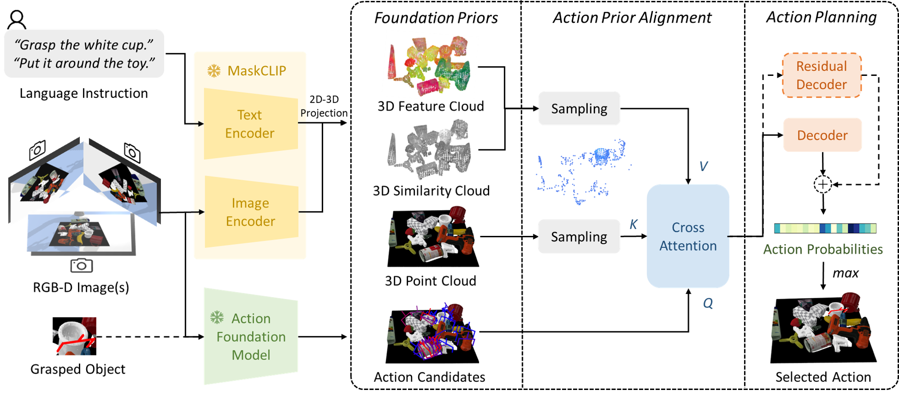

# Efficient Alignment of Unconditioned Action Prior for Language-conditioned Pick and Place in Clutter
This is the official repository for the paper: Efficient Alignment of Unconditioned Action Prior for Language-conditioned Pick and Place in Clutter.

[Paper](https://arxiv.org/abs/2503.09423) | [Video](https://www.bilibili.com/video/BV1dPX4YzEzk/?spm_id_from=333.1391.0.0)

We study the task of language-conditioned pick and place in clutter, where a robot should grasp a target object in open clutter and move it to a specified place. Some approaches learn end-to-end policies with features from vision foundation models, requiring large datasets. Others combine foundation models in a zero-shot setting, suffering from cascading errors. In addition, they primarily leverage vision and language foundation models, focusing less on action priors. In this paper, we aim to develop an effective policy by integrating foundation priors from vision, language, and action. We propose A2, an action prior alignment method that aligns unconditioned action priors with 3D vision-language priors by learning one attention layer. The alignment formulation enables our policy to train with less data and preserve zero-shot generalization capabilities. We show that a shared policy for both pick and place actions enhances the performance for each task, and introduce a policy adaptation scheme to accommodate the multi-modal nature of actions. Extensive experiments in simulation and the real-world show that our policy achieves higher task success rates with fewer steps for both pick and place tasks in clutter, effectively generalizing to unseen objects and language instructions.



#### Contact

Any question, please let me know: kcxu@zju.edu.cn

## Setup
###  Installation (uv, Python 3.10/3.11)
Prereqs:
- Ubuntu 20.04+, uv installed, CUDA toolkit that matches your GPU/driver (we tested CUDA 12.4).
- The upgraded GraspNet baseline is **not** tracked in this repo (`models/graspnet_new` is gitignored), so you must clone it yourself.

```
git clone git@github.com:xukechun/Action-Prior-Alignment.git
cd Action-Prior-Alignment

# clone the upgraded GraspNet baseline into the expected path
git clone https://github.com/H-Freax/GraspNet-PointNet2-Pytorch-General-Upgrade.git models/graspnet_new

# create the virtualenv with uv (pick 3.10 or 3.11)
uv venv --python 3.11 .venv
source .venv/bin/activate

# install torch that matches your CUDA (example for CUDA 12.4)
uv pip install --index-url https://download.pytorch.org/whl/cu124 torch torchvision torchaudio

# project deps + editable install
uv pip install -r requirements.txt
uv pip install -e .

# build the GraspNet custom ops (requires nvcc matching your torch CUDA)
export CUDA_HOME=/usr/local/cuda-12.4           # adjust to your CUDA install
<!-- export PATH=$CUDA_HOME/bin:$PATH
export LD_LIBRARY_PATH=$CUDA_HOME/lib64:$LD_LIBRARY_PATH
export TORCH_CUDA_ARCH_LIST="8.0+PTX"           # A100 = 8.0; adjust for your GPU
export FORCE_CUDA=1 -->

cd models/graspnet_new/pointnet2
uv pip install -e .
cd ../knn
uv pip install -e .
cd ../../..
```
- Download the GraspNet pretrained weights (`checkpoint-rs.tar`) and place it at `models/graspnet_new/checkpoint-rs.tar` (or update `utils/utils.py` to point elsewhere).
  - Example download with uv + gdown:
    ```
    uv pip install gdown
    uv run python -m gdown "https://drive.google.com/uc?id=1hd0G8LN6tRpi4742XOTEisbTXNZ-1jmk" -O models/graspnet_new/checkpoint-rs.tar
    ```
- Use `uv run` for any manual Python commands to ensure the local packages (like `helpers/`) resolve correctly.
- The GraspNet PointNet2 ops are CUDA-only; make sure a CUDA-capable GPU/driver is visible when running tests or training.

###  Installation (legacy conda)
If you prefer conda (CUDA 11.3 / PyTorch 1.10.1 as in the original paper):
```
git clone git@github.com:xukechun/Action-Prior-Alignment.git
cd Action-Prior-Alignment

git clone https://github.com/H-Freax/GraspNet-PointNet2-Pytorch-General-Upgrade.git models/graspnet_new

conda create -n a2 python=3.8
conda activate a2
pip install -r requirements.txt
pip install -e .
cd models/graspnet_new/pointnet2 && pip install -e .
cd ../knn && pip install -e .
```

###  Potential Issues of Installation
- When installing graspnetAPI, the following problem might occur:
```
× python setup.py egg_info did not run successfully.
│ exit code: 1
╰─> [18 lines of output]
The 'sklearn' PyPI package is deprecated, use 'scikit-learn'
rather than 'sklearn' for pip commands.
```
solution:
```
export SKLEARN_ALLOW_DEPRECATED_SKLEARN_PACKAGE_INSTALL=True
```
- Check the compatible version of torch and torchvision of your machine (especially the cuda vision) if the following problem occurs:
```
RuntimeError: CUDA error: no kernel image is available for execution on the device
```
solution: install torch with the right CUDA wheels (e.g., replace the `cu124` index URL above if you use a different toolkit).
- If `knn` fails to build with `fatal error: THC/THC.h: No such file or directory`, run the patch script and rebuild:
  ```
  uv run python scripts/setup/patch_graspnet_knn.py
  ```
  (Then rerun the `pip install -e .` step inside `models/graspnet_new/knn`.)
- If you see `ModuleNotFoundError: No module named 'helpers'`, you likely ran a file directly. Use `uv run python -m a2.train.main ...` (or the provided shell scripts).

###  Easy Installation

If you use conda, we provide our conda environment produced by ```conda-pack``` in this [link](https://huggingface.co/datasets/KechunXu1/A2_Dataset/blob/main/vilg3d.tar.gz). NOTE: This environment is compatiable with CUDA 11.3.

Then you can easily build and activate the conda environment by
```
cd 'PATH OF YOUR CONDA ENVS'
mkdir a2
tar -xzvf a2.tar.gz -C a2
conda activate a2

python setup.py develop

cd models/graspnet_new/pointnet2
pip install -e .

cd ../knn
pip install -e .
```

### Assets
We provide the processed object models in this [link](https://drive.google.com/drive/folders/1WxKDFXJktoqiP0jmkDZrMCcNNBx5u-YM?usp=drive_link). Please download the file and unzip it in the `assets` folder.

### Data and Pre-trained Models
We provide our training data in this [link](https://huggingface.co/datasets/KechunXu1/A2_Dataset). Please download the file and unzip it in the `data` folder. 

We provide our testing cases in this [link](https://drive.google.com/drive/folders/1OuTua-69NEeV7RYIi9nzR1jmdZEugB68?usp=sharing). Please download the file and unzip it in the `testing_cases` folder. 

We provide our pre-trained models in this [link](https://drive.google.com/drive/folders/1uoDGIgkcSi8okcr8qjKOaF57TyRaHRd_?usp=sharing). Please download the file and unzip it in the `logs` folder.

### Data Collection
- For pick data
```
bash scripts/data_collection/collect_data_grasp.sh
```
- For place data
```
bash scripts/data_collection/collect_data_place.sh
```
- For unified pick+place data (recreates `data/a2_pp_data.npy` and saves per-episode frames)
```
bash scripts/data_collection/collect_data_pp.sh
```
Frame dumps go to `data/a2_pp_frames` (disable with `--no_record`).

## Training

- Unified training for pick and place
```
bash scripts/train/train_clutter_gp_unified.sh
```
- Adaptation for place
```
bash scripts/train/train_clutter_gp_adaptive.sh
```


## Evaluation
To test the pre-trained model, simply change the location of `--model_path`:

- Pick
```
bash scripts/test/test_grasp.sh
```
- Place
```
bash scripts/test/test_place.sh
```
- Pick and place
```
bash scripts/test/test_pickplace.sh
```

## Citation

If you find this work useful, please consider citing:

```
@article{xu2025efficient,
  title={Efficient Alignment of Unconditioned Action Prior for Language-conditioned Pick and Place in Clutter},
  author={Xu, Kechun and Xia, Xunlong and Wang, Kaixuan and Yang, Yifei and Mao, Yunxuan and Deng, Bing and Xiong, Rong and Wang, Yue},
  journal={arXiv preprint arXiv:2503.09423},
  year={2025}
}
```
